# Usage guide

A hands-on walkthrough of the Pro Rata Time Export plugin for someone who already knows Kimai's basic UI (customers, projects, activities, timesheets) but has not used this plugin before. Every screenshot was captured from a fresh Kimai 2.65.0 instance with the plugin installed and no pre-existing data. The names, rates and amounts are demo data.

- [Two different "rates" — read this first](#two-different-rates--read-this-first)
- [Part 1: Basic walkthrough](#part-1-basic-walkthrough)
- [Part 2: Advanced usage](#part-2-advanced-usage)
- [Reading the export output](#reading-the-export-output)

## Two different "rates" — read this first

The plugin involves two unrelated kinds of rate. Mixing them up is the most common source of confusion.

| | What it is | Where you set it | What it controls |
|---|---|---|---|
| **Hourly rate** (Kimai's own) | The price of an hour of work for a customer, project or activity. Native Kimai feature. | Customer / Project / Activity → **Prices** (`…/rate` screen) | The *effective rate* stamped on each timesheet record when it is saved. |
| **Employer Base Rate** (this plugin) | The single nominal hourly rate your employer's timecard is expressed in. | User preferences, or an override field on a Customer or Project edit form. | What the plugin converts every record *to*. |

The plugin does not change Kimai's hourly rates and never looks them up itself. It reads the effective rate already stored on each timesheet record, then computes:

```text
factor            = effective hourly rate / Employer Base Rate
equivalent time   = recorded time × factor   (rounded to the whole minute, half-up)
```

So a record worked at €120/hr against a €150/hr Employer Base Rate has a factor of 0.8: 3 recorded hours become 2h 24m of compensation-equivalent time, which is worth the same money (€360.00) at the employer's rate.

**Which Employer Base Rate applies to a record** is resolved in this order, first match wins:

1. Project override (Employer Base Rate field on the Project)
2. Customer override (Employer Base Rate field on the Customer)
3. User preference (Employer Base Rate in the user's preferences)

There is no built-in default. If none of the three is set for a record, the export fails with an explicit error instead of guessing. In this guide only the user preference is set for Part 1, and one project override is added in Part 2.

## Part 1: Basic walkthrough

The goal: one user, two customers with different hourly rates, one project and one activity for each, some tracked time, and an export.

### 1. Create a user and set their Employer Base Rate

As an administrator, open **System → Users → Create**, fill in the user (here `alice`) and save.

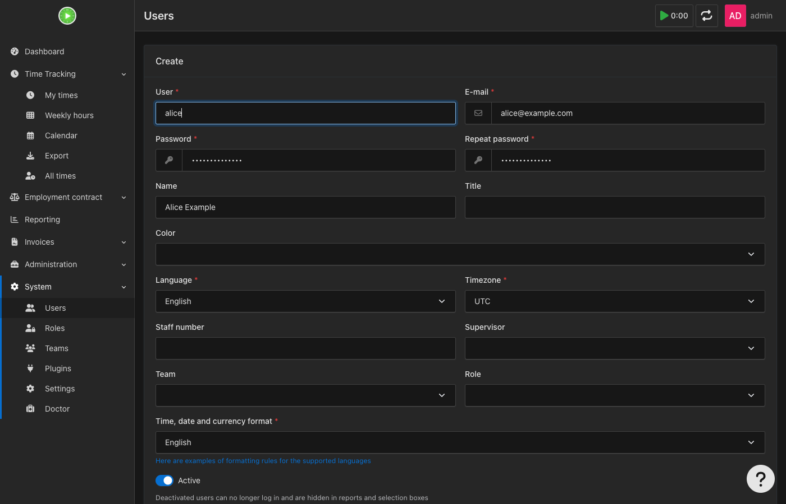

Then open the user's **Preferences** (`/en/profile/alice/prefs`). The plugin adds an **Employer Base Rate** field at the bottom. Enter the rate your employer pays for a standard hour — here `150.00` — and save.

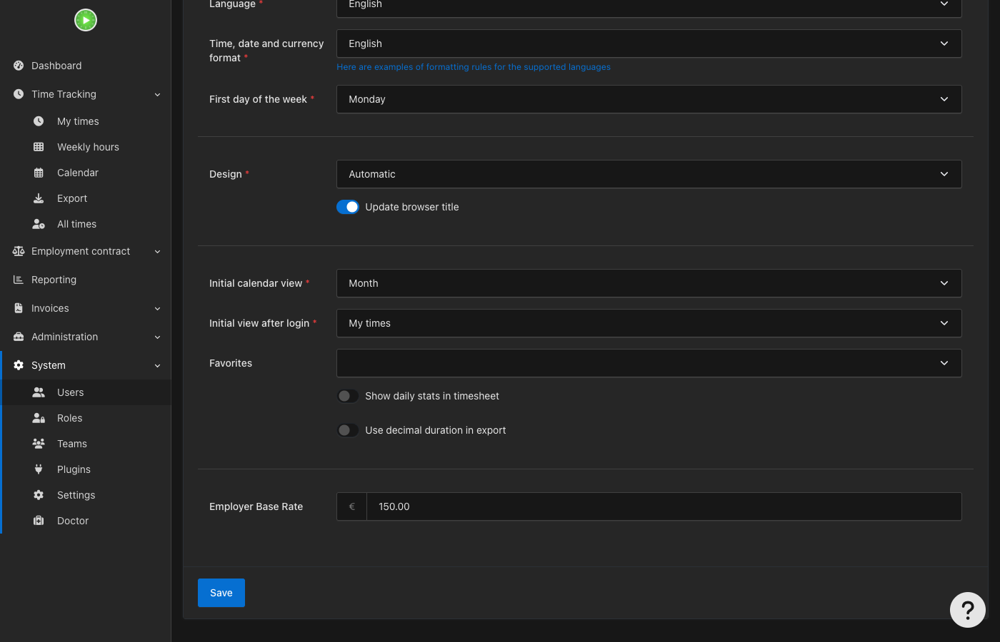

Leave Kimai's own "Hourly rate" preference alone; it is a different setting (see above).

### 2. Create two customers

Under **Administration → Customers → Create**, add `Northwind Traders` and `Contoso Ltd`. The customer form has an **Employer Base Rate** override field further down; leave it empty here so Alice's user-level €150 applies to everything.

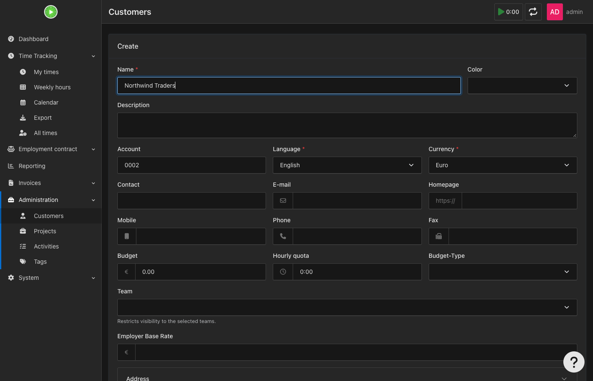

### 3. Create one project under each customer

Under **Administration → Projects → Create**, add `Website Redesign` (customer Northwind Traders) and `Mobile App` (customer Contoso Ltd).

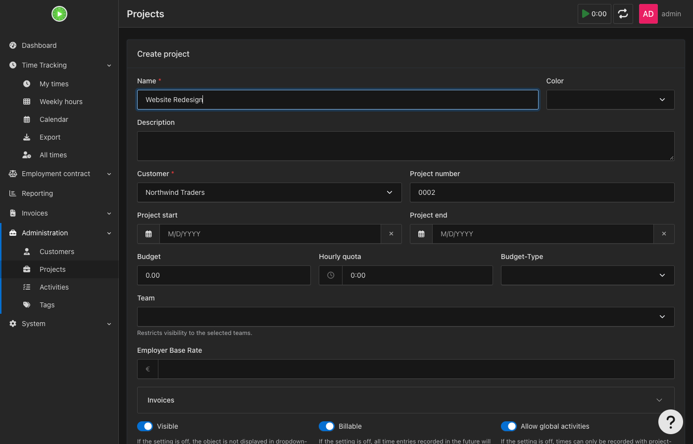

### 4. Create one activity under each project

Under **Administration → Activities → Create**, add an activity named `Development` to each of the two projects.

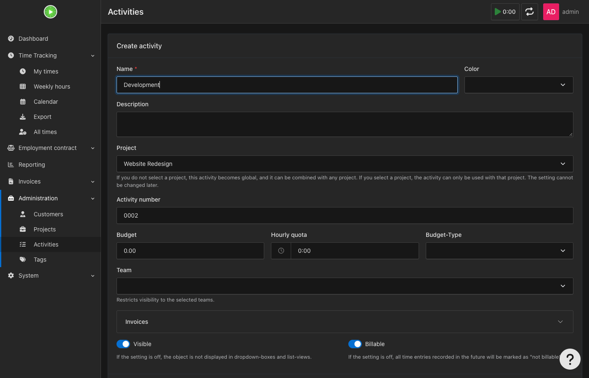

### 5. Set a different Kimai hourly rate on each customer

This step is Kimai's own hourly billing rate, not the plugin's Employer Base Rate. Open each customer's details page, use **Prices → +**, and enter an hourly price:

| Customer | Kimai hourly rate |
|---|---|
| Northwind Traders | €120.00 |
| Contoso Ltd | €200.00 |

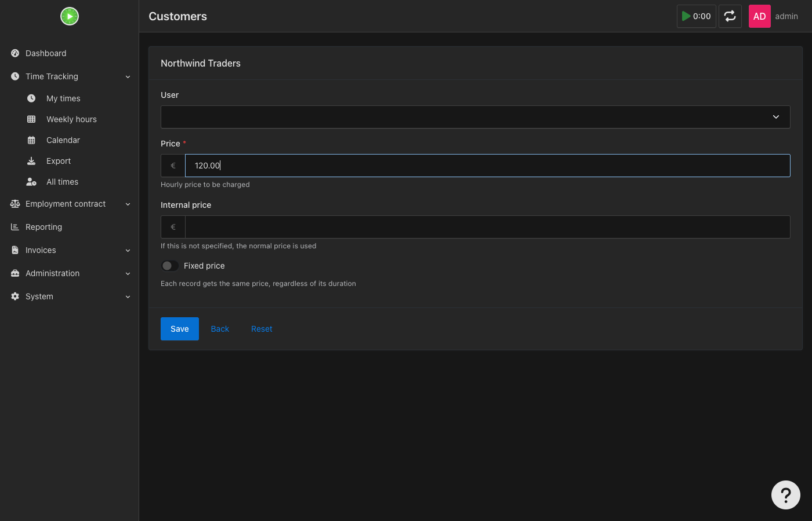

After saving, the rate appears under **Prices** on the customer page.

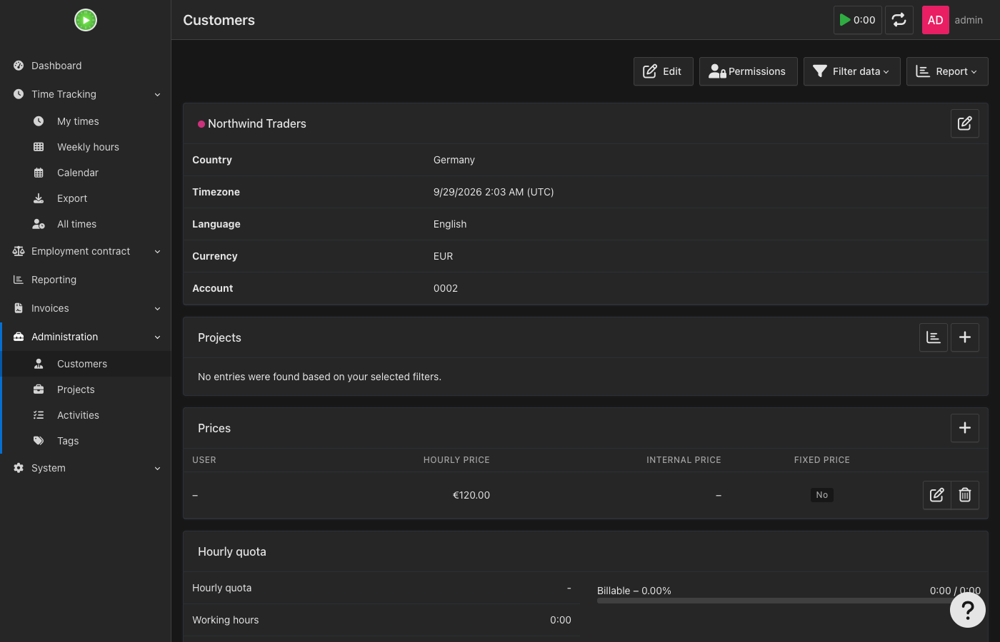

Kimai stamps the applicable hourly rate onto each timesheet record at the moment it is saved. Projects and activities inherit the customer's rate unless they have their own (Part 2 shows this). The plugin later reads the stamped value, so **changing a rate afterwards does not alter records already tracked**.

### 6. Track some time

Record time against these projects as usual. This guide's data for Alice:

| Date | Time | Customer / Project | Kimai rate |
|---|---|---|---|
| 2026-09-21 | 09:00–12:00 | Northwind Traders / Website Redesign | €120 |
| 2026-09-22 | 13:00–17:00 | Contoso Ltd / Mobile App | €200 |
| 2026-09-23 | 09:17–09:54 (37 min) | Northwind Traders / Website Redesign | €120 |
| 2026-09-24 | 10:00–14:00 | Contoso Ltd / Mobile App | €200 |
| 2026-09-25 | 08:30–12:30 | Northwind Traders / Website Redesign | €120 |

### 7. Export

Open **Time Tracking → Export**, choose the reporting period (and users/projects if you want to narrow it), and click **Search**.

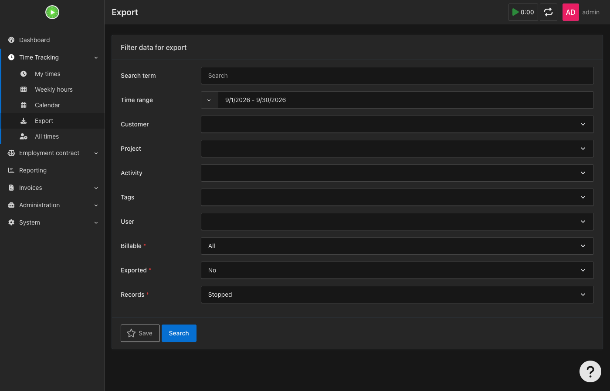

Below the preview, Kimai's export button bar now includes the plugin's four options, grouped under the format they produce:

| Menu | Entry | Produces |
|---|---|---|
| **CSV** | Compensation Equivalent Timecard (CSV) | Employer-facing rows: Date, User, Project, Start, End |
| **CSV** | Compensation Equivalent Reconciliation (Audit CSV) | Full audit trail, one row per source timesheet |
| **Print** | Compensation Equivalent (Review) | HTML review page: actual and equivalent values side by side |
| **Excel** | Compensation Equivalent Timecard (XLSX) | Workbook with Employer Timecard, Reconciliation and Summary sheets |

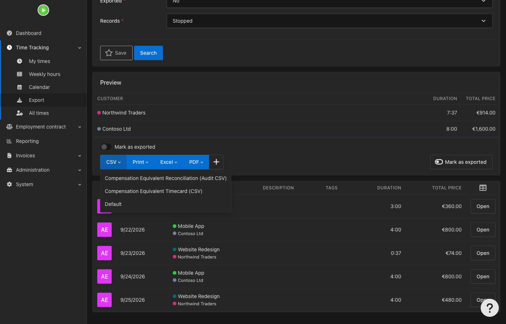

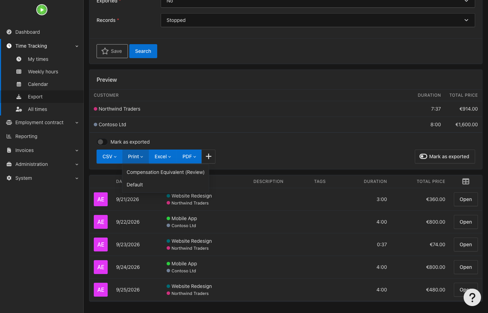

Start with **Compensation Equivalent (Review)** — check the numbers on screen before you download anything:

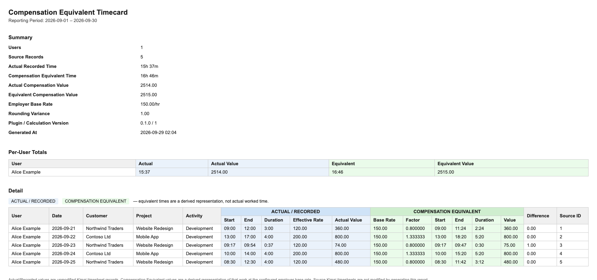

What to notice:

- Northwind Traders' records are at an effective rate of €120 against the €150 base rate: factor `0.800000`. The 3-hour record (09:00–12:00) becomes 09:00–11:24 (2:24), worth the same €360.00.
- Contoso Ltd's records are at €200: factor `1.333333`. The 4-hour record (13:00–17:00) becomes 13:00–18:20 (5:20), worth €800.00.
- The 37-minute record demonstrates rounding. 37 min × 0.8 = 29.6 min, rounded to 30. The equivalent value is €75.00 against an actual €74.00, a **Difference** of €1.00. This is the total rounding variance shown in the summary.
- The equivalent start is always the real start time. Only the end is derived.
- The Summary shows totals: 15h 37m recorded became 16h 46m equivalent, €2514.00 actual vs €2515.00 equivalent.

The employer-facing CSV (**Compensation Equivalent Timecard (CSV)**) contains only what your employer needs, then summary rows:

```csv
Date,User,Project,Start,End
2026-09-21,"Alice Example","Website Redesign",09:00,11:24
2026-09-22,"Alice Example","Mobile App",13:00,18:20
2026-09-23,"Alice Example","Website Redesign",09:17,09:47
2026-09-24,"Alice Example","Mobile App",10:00,15:20
2026-09-25,"Alice Example","Website Redesign",08:30,11:42
```

The audit CSV keeps the full trail for each source record (source timesheet ID, effective rate, base rate, conversion factor, actual and equivalent start/end/duration, actual/equivalent compensation, rounding difference):

```csv
"Source Timesheet ID",User,Date,Customer,Project,Activity,"Actual Start","Actual End","Actual Duration","Effective Rate","Employer Base Rate","Conversion Factor","Equivalent Start","Equivalent End","Equivalent Duration","Actual Compensation","Equivalent Compensation","Rounding Difference"
3,"Alice Example",2026-09-23,"Northwind Traders","Website Redesign",Development,"2026-09-23 09:17","2026-09-23 09:54",0:37,120.00,150.00,0.800000,"2026-09-23 09:17","2026-09-23 09:47",0:30,74.00,75.00,1.00
```

Generating any of these never edits or marks-as-exported the underlying Kimai timesheets. Leave **Mark as exported** off for Pro Rata Time Export reports; these exports fail when that Kimai option is enabled. Use Kimai's built-in export workflow separately if you need to mark source timesheets as exported.

## Part 2: Advanced usage

The same flow at larger scale, with rates set at all three levels (customer, project, activity) and one Employer Base Rate override. A second user, `bob`, has an Employer Base Rate of **€100.00** in his preferences.

### The setup

Kimai resolves which hourly rate a record gets by checking the most specific place first: an activity rate wins over a project rate, which wins over the customer rate. A project or activity with no rate of its own inherits from above.

| Customer (Kimai rate) | Project (rate) | Activity (rate) |
|---|---|---|
| **Fabrikam Inc** (€90) | Data Platform (inherits €90) | Engineering (€90) |
| | | Code Review (**€110**) |
| | Support Retainer (**€60**) | Triage (€60) |
| | | On-call (**€75**) |
| **Tailspin Toys** (€150) | Game Engine (inherits €150) | Design (€150) |
| | | QA (**€100**) |
| | Marketing Site (**€120**) | Content (€120) |
| | Legacy Migration (inherits €150) | Analysis (€150) |
| | | Cutover (**€180**) |
| **Wingtip Consulting** (€100) | Audit 2026 (inherits €100) | Fieldwork (€100) |
| | | Reporting (**€80**) |
| | Advisory (**€130**, plus base rate override **€125**) | Workshops (€130) |
| | | Executive Coaching (**€160**) |

Bold entries are values set explicitly at that level. Customers have 2, 3 and 2 projects; projects have 1–2 activities.

Project and activity rates are set the same way as customer rates in Part 1: open the project or activity's details page and use **Prices → +**.

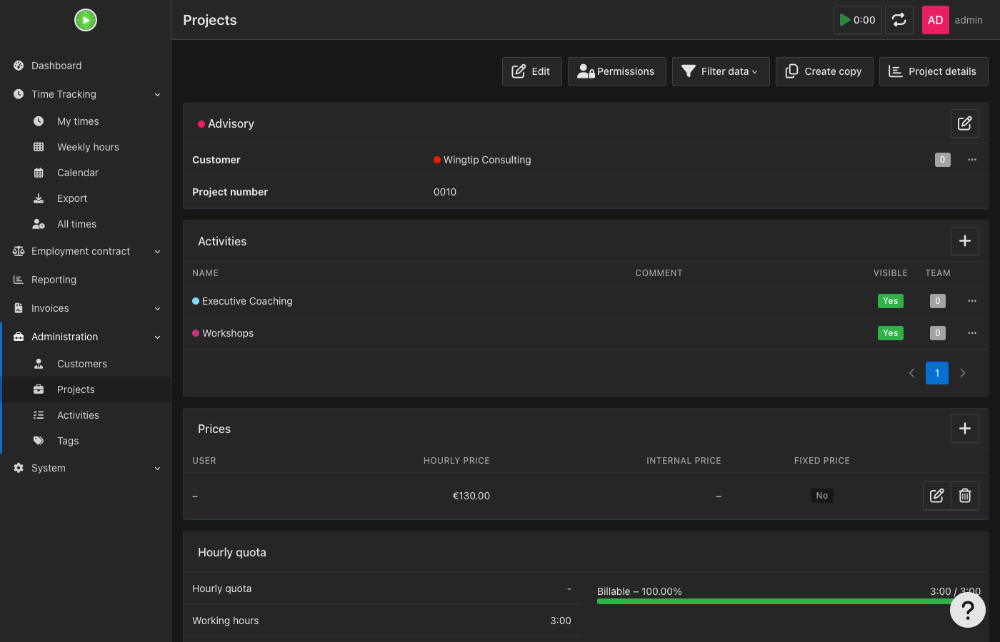

### An Employer Base Rate override

Bob's user preference says €100, but the *Advisory* project is a special engagement whose employer pays on a different base. On the project's edit form the plugin adds an **Employer Base Rate** field (customers have the same field). Here it is set to `125.00`:

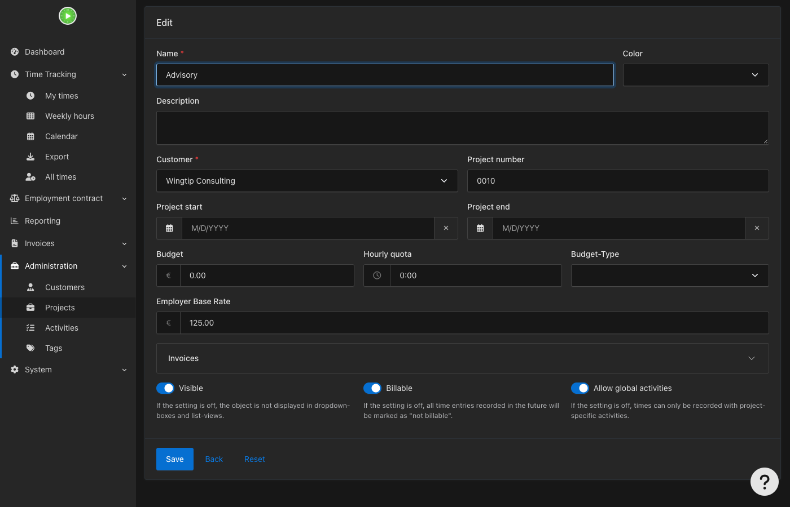

Records on Advisory are now converted to a €125 base; all other records use Bob's €100. Note that this override is separate from Advisory's own €130 hourly price shown above: the hourly price says what the work is worth, the override says what base rate that project's equivalent time is expressed in.

### Time tracked

Bob logged 14 records on 2026-09-14 to 2026-09-18 covering every activity above. Filter the export to the week and Bob:

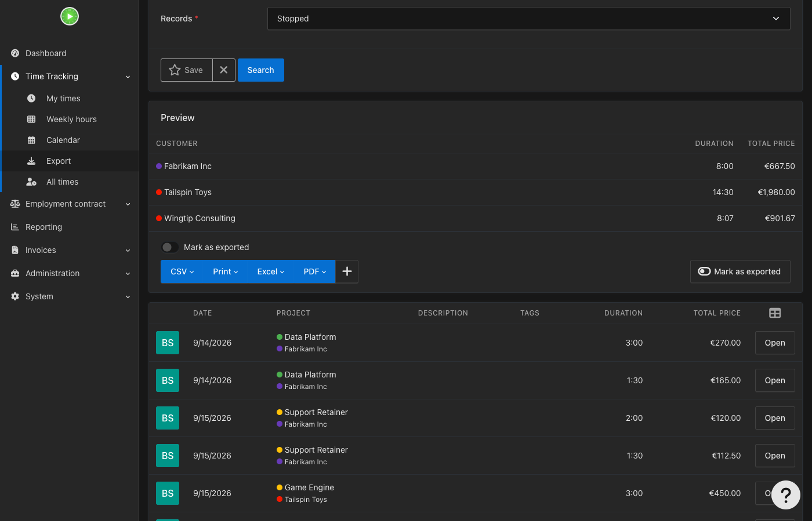

### The review output

Choose **Print → Compensation Equivalent (Review)**:

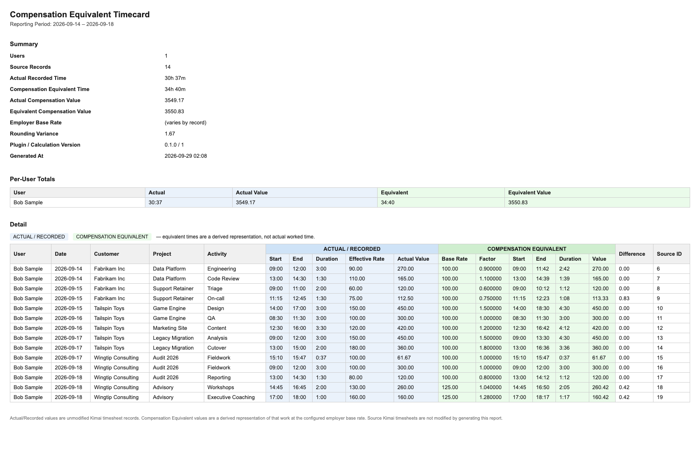

Reading it:

- **Employer Base Rate: "(varies by record)"** in the summary, because the Advisory records use €125 and the rest use €100. If every record used one base rate it would show that number, as in Part 1.
- Rates at every level flow through unchanged in **Effective Rate**: Engineering €90 (customer rate), Code Review €110 (activity override), Triage €60 (project rate), On-call €75 (activity override), Content €120 (project rate), Cutover €180 (activity override), and so on.
- Each factor is that record's rate divided by its base rate. Engineering: 90 / 100 = `0.900000`, so 3:00 becomes 2:42. QA: 100 / 100 = `1.000000`, so time is unchanged. Cutover: 180 / 100 = `1.800000`, so 2:00 becomes 3:36. Workshops: 130 / 125 = `1.040000`, so 2:00 becomes 2:05.
- Records where the equivalent is not a whole minute show a small **Difference** from rounding (for example On-call: €112.50 actual, €113.33 equivalent, €0.83). The Summary's **Rounding Variance** of €1.67 is the sum of these.
- **Actual Compensation Value** €3549.17 vs **Equivalent Compensation Value** €3550.83: identical apart from rounding, which is the point — the employer sees fewer or more hours at the base rate but the money is preserved.

The CSV, audit CSV and XLSX exports for this same filter contain the same data in their respective layouts.

## Reading the export output

| Term | Meaning |
|---|---|
| Actual / Recorded | Exactly what is stored in Kimai. Unmodified. |
| Effective Rate | The hourly rate stamped on the source timesheet by Kimai when it was saved. |
| Base Rate | The Employer Base Rate that resolved for that record (project → customer → user). |
| Factor | Effective Rate ÷ Base Rate. Above 1 lengthens the time; below 1 shortens it. |
| Equivalent Start / End / Duration | The derived compensation-equivalent interval. Start equals the real start. Duration is rounded to the whole minute, half-up. |
| Difference | Equivalent Value − Actual Value, caused only by minute rounding. |

Permissions: the review, both CSVs and the XLSX require the same permission Kimai uses for rate visibility elsewhere (`view_rate_own_timesheet` for a single-user export, `view_rate_other_timesheet` otherwise). Users without it are denied rather than shown a redacted view.

For the underlying model, rounding rules, warnings (running records, overlaps) and known limitations, see the [README](../README.md).
